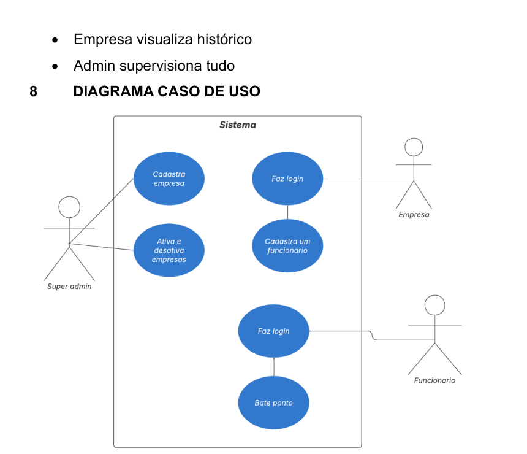
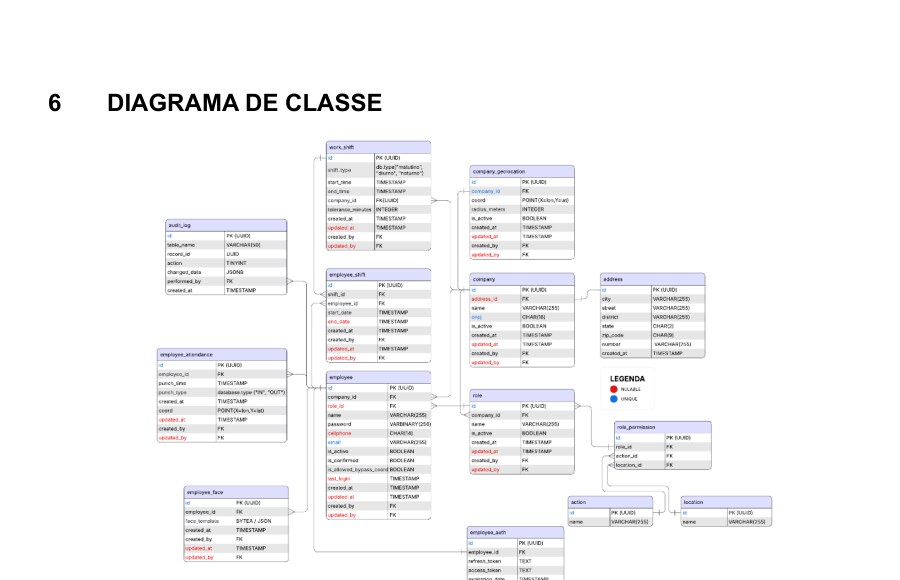
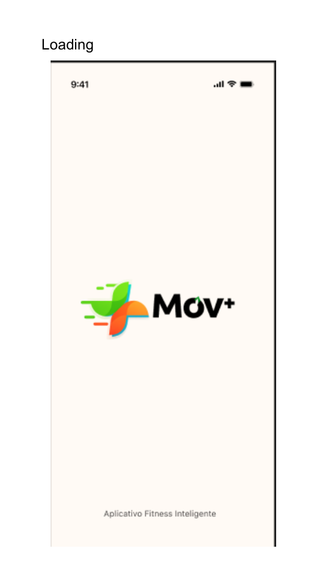
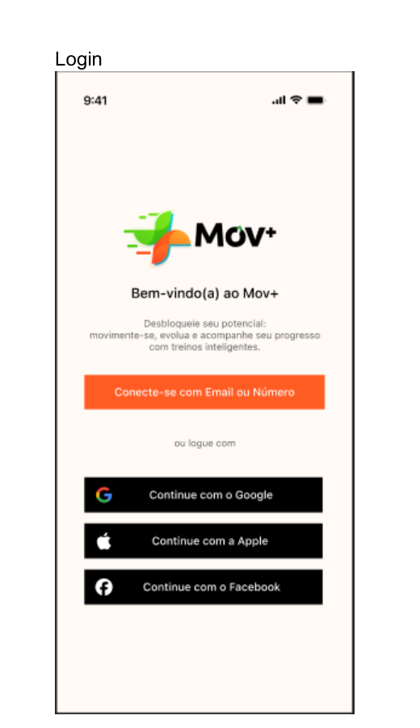
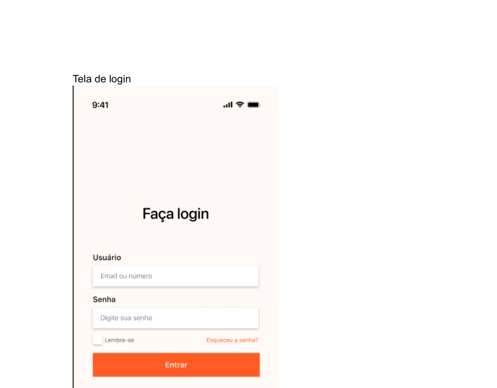
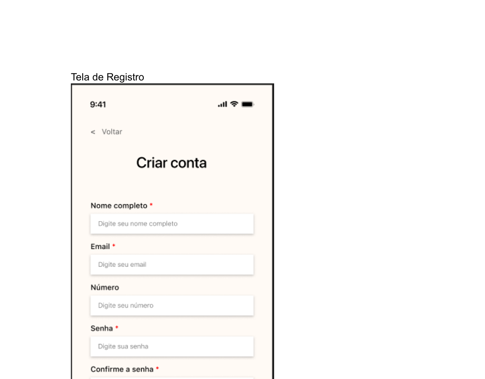
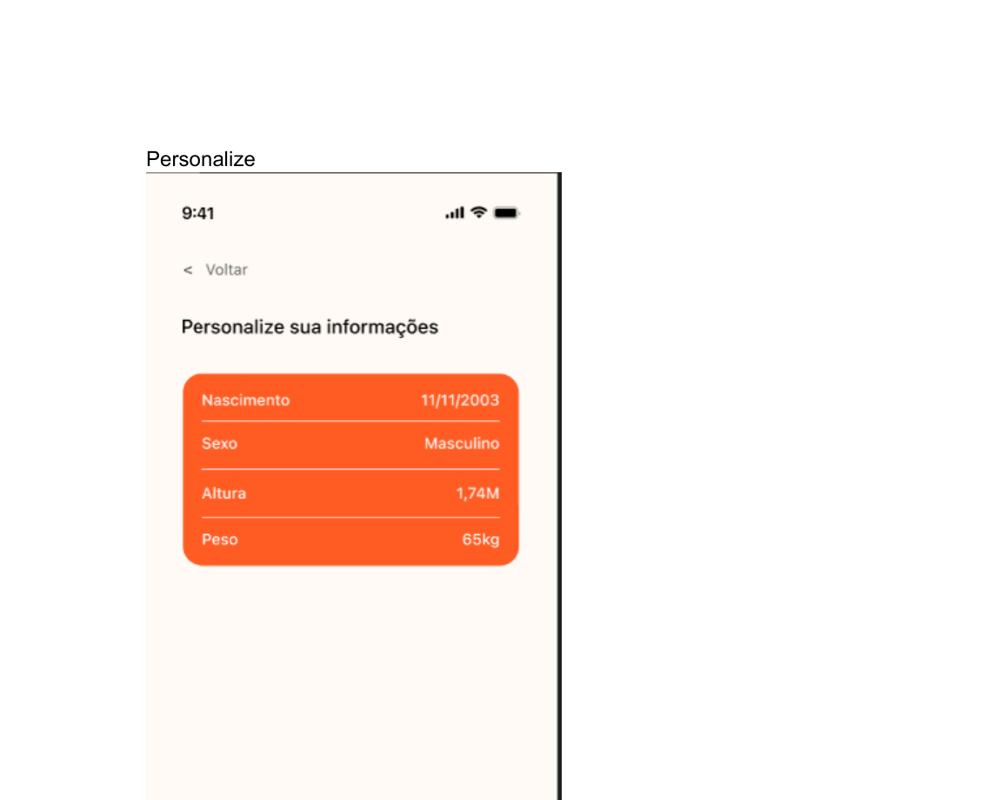
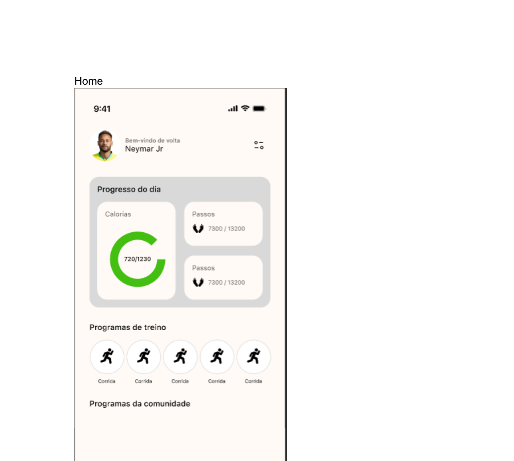
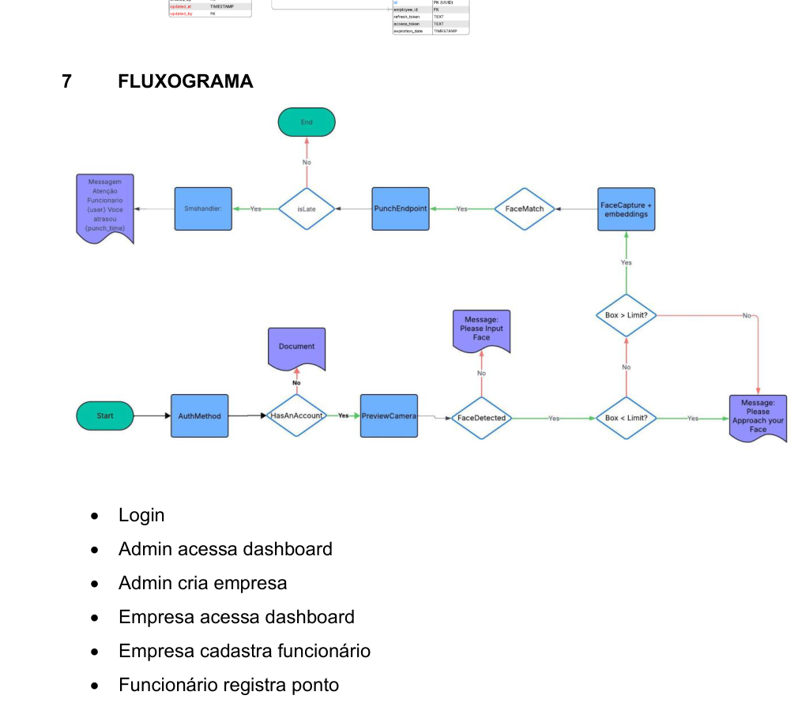

<strong><em>Documentação do PI</em></strong>

> **Projeto:** DeltaFour PontoIA  
> **Instituição:** Centro Paula Souza - Faculdade de Tecnologia de Jahu  
> **Curso:** Tecnologia em Desenvolvimento de Software Multiplataforma  
> **Semestre:** 5º semestre / 2025  
> **Equipe:** Otavio Martins, Gabriel Fogo, Arthur Servidor e Rafael Paschoalotti  
> **Empresa parceira:** CLAF SOLUCOES EM TECNOLOGIA DA INFORMACAO LTDA – ME  
> **Endereço da parceira:** Rua Gen Isidoro, 383, Sala 01 - Ch Braz Miraglia - Jaú/SP - CEP 17207-270

  
<strong>📑 Sumário</strong>

- [1. Introdução](#1-introdução)
  - [Objetivos](#-objetivos)
  - [Metodologia](#-metodologia)
- [2. Requisitos](#2-requisitos)
  - [Requisitos funcionais](#-requisitos-funcionais)
  - [Requisitos não funcionais](#-requisitos-não-funcionais)
- [3. Modelo de casos de uso](#3-modelo-de-casos-de-uso)
- [4. Modelo do banco de dados](#4-modelo-do-banco-de-dados)
- [5. Banco de dados](#5-banco-de-dados)
- [6. Diagrama de classes](#6-diagrama-de-classes)
- [7. Estudo de viabilidade](#7-estudo-de-viabilidade)
- [8. Regras de negócio (Modelo canvas)](#8-regras-de-negócio-modelo-canvas)
- [9. Design](#9-design)
- [10. Protótipo](#10-protótipo)
- [11. Aplicação](#11-aplicação)

> Esta adaptação reorganiza a documentação original em formato ABNT para o template de documentação em Git, preservando o conteúdo e as imagens já presentes no material-base.  
> **Observação importante:** as telas anexadas à documentação original utilizam a identidade visual **Mov+**. Nesta versão, esse material foi mantido fielmente como aparece no PDF de origem.

# 1. Introdução

O registro de ponto é uma atividade essencial para empresas que precisam acompanhar a jornada de trabalho de seus colaboradores de maneira precisa, segura e confiável. Ainda assim, muitas organizações dependem de sistemas ultrapassados ou pouco integrados, o que gera inconsistências no registro, baixa transparência, dificuldade de gestão e ausência de relatórios dinâmicos.

Para atender a esse cenário, o **DeltaFour PontoIA** foi proposto como uma plataforma voltada à gestão de ponto eletrônico, com foco em centralizar o controle de presença, o cadastro de funcionários, o gerenciamento de empresas e a visualização de relatórios. A proposta busca oferecer mais praticidade, segurança, organização e possibilidade de expansão futura.

A documentação original também descreve o projeto como uma solução preparada para ambientes corporativos dinâmicos, unindo recursos web e mobile para oferecer uma experiência escalável, intuitiva e eficiente. A plataforma contempla perfis distintos de uso, com área administrativa e painel dedicado às empresas, além da possibilidade de evolução para integrações com IoT.

## • Objetivos

### Objetivo geral

Desenvolver um sistema mobile de ponto eletrônico capaz de centralizar o controle de jornada de trabalho, oferecendo uma solução completa para administradores, empresas e funcionários, com segurança, organização e fácil utilização.

### Objetivos específicos

- Permitir que o administrador cadastre, edite e exclua empresas.
- Disponibilizar uma dashboard exclusiva para cada empresa.
- Gerenciar cadastro e dados dos funcionários de forma simples.
- Registrar entradas e saídas de ponto com precisão e segurança.
- Implementar autenticação segura para usuários e empresas.
- Integrar métodos modernos para facilitar escalabilidade e manutenção.
- Prover interface clara, moderna e intuitiva para todos os perfis de usuário.

## • Metodologia

A metodologia escolhida para o desenvolvimento foi o **Scrum**, por sua flexibilidade, divisão clara de tarefas e foco em entregas incrementais. A equipe organizou o trabalho em sprints para conduzir a evolução do backend, frontend, interface e documentação.

### Como?

- Desenvolvimento incremental com sprints.
- Divisão das atividades entre backend, frontend, interface e documentação.
- Comunicação contínua e adaptação rápida a mudanças.

### Com o que?

- **Versionamento de código:** Git e GitHub  
  Repositório informado no documento original: `https://github.com/DeltaFour`
- **Aplicação mobile (Android):** .NET MAUI, Xamarin e .NET 8
- **API / Backend:** .NET 8, ASP.NET Core, Identity e Entity Framework
- **Frontend:** ReactJS, TailwindCSS e ViteJs
- **Infraestrutura:** Docker e MySQL

### Onde? Quando?

- **Onde:** aplicação administrativa em ambiente web e aplicativo mobile para uso operacional.
- **Quando:** documentação referente ao **5º semestre de 2025**.

# 2. Requisitos

## • Requisitos funcionais

- **RF01 - Autenticação:** o sistema deve permitir login e cadastro de administradores e empresas.
- **RF02 - CRUD de Empresas:** o administrador pode criar, editar, listar e excluir empresas.
- **RF03 - Dashboard do Administrador:** área exclusiva com métricas e atalhos.
- **RF04 - CRUD de Funcionários:** cada empresa pode cadastrar, editar e excluir seus funcionários.
- **RF05 - Registro de Ponto:** o funcionário pode registrar entrada e saída.
- **RF06 - Histórico de Ponto:** a empresa pode visualizar os registros de seus funcionários.
- **RF07 - Perfis de Acesso:** administrador, empresa e funcionário possuem permissões distintas.
- **RF08 - Edição de Dados:** empresas podem atualizar suas informações.
- **RF09 - Notificações Internas:** exibir avisos e mensagens rápidas no painel.
- **RF10 - Banco de Dados MySQL:** registros organizados em estrutura relacional.

## • Requisitos não funcionais

A documentação original apresenta os requisitos não funcionais abaixo. Para se adequar ao template, eles foram reorganizados por categoria:

### Requisitos de produto

- **RNF01 - Usabilidade:** interface intuitiva com navegação clara.
- **RNF02 - Desempenho:** respostas rápidas e eficientes.
- **RNF04 - Compatibilidade:** funcionamento em navegadores modernos.

### Requisitos de organização

- **RNF08 - Manutenibilidade:** arquitetura modular e organizada.
- Organização do desenvolvimento em sprints, com versionamento por Git e GitHub.

### Requisitos de confiabilidade

- **RNF06 - Confiabilidade:** preservação e consistência dos dados.
- **RNF07 - Disponibilidade:** sistema acessível com mínima indisponibilidade.

### Requisito de implementação

- **RNF03 - Segurança:** uso de criptografia, JWT e boas práticas de autenticação.
- **RNF05 - Escalabilidade:** backend preparado para expansão.

### Requisito de padrões

A documentação original não detalha um padrão formal específico além das boas práticas adotadas no desenvolvimento. Ainda assim, registra organização modular, autenticação segura e versionamento do código como diretrizes do projeto.

### Requisitos de interoperabilidade

- Compatibilidade com navegadores modernos.
- Preparação para futuras integrações com IoT, como dispositivos biométricos, RFID, NFC e ESP32.

# 3. Modelo de casos de uso

O modelo de casos de uso apresentado na documentação original contempla três atores principais:

- **Super admin**
  - Cadastra empresa
  - Ativa e desativa empresas
- **Empresa**
  - Faz login
  - Cadastra um funcionário
- **Funcionário**
  - Faz login
  - Bate ponto

  

# 4. Modelo do banco de dados

A documentação base descreve o banco de dados do projeto como um **modelo relacional em MySQL**, estruturado para priorizar consistência, segurança, rastreabilidade e performance. Para aderir ao template, o conteúdo foi reorganizado em três níveis:

## • Modelo conceitual

O domínio da aplicação gira em torno das seguintes entidades e conceitos centrais:

- Administrador
- Empresa
- Funcionário
- Turno de trabalho
- Registro de ponto
- Permissões e perfis de acesso
- Endereço
- Arquivos
- Localização
- Auditoria

## • Modelo lógico

A modelagem lógica apresentada visualmente no documento original evidencia relacionamentos entre entidades como:

- empresa e funcionário;
- funcionário e turnos;
- funcionário e registro de ponto;
- perfis, ações, localizações e permissões;
- auditoria e dados de autenticação.

Também fica explícito o isolamento do painel por empresa e o controle de acesso por perfil.

## • Modelo físico

No modelo físico informado pela documentação original:

- o banco é implementado em **MySQL**;
- a estrutura utiliza **UUID** como chave primária;
- as entidades aparecem normalizadas;
- a base foi pensada para suportar rastreabilidade, auditoria e futuras integrações com IoT.

# 5. Banco de dados

## Visão geral

O banco de dados do **DeltaFour PontoIA** foi projetado em **MySQL** utilizando um modelo relacional robusto, orientado à consistência, segurança e performance.

A modelagem atende às necessidades da aplicação de ponto eletrônico, garantindo:

- Integridade dos dados
- Rastreabilidade de ações
- Controle de permissões
- Auditoria completa
- Escalabilidade para futuras integrações com IoT

O diagrama foi estruturado em **entidades normalizadas**, com utilização de **UUID** como chave primária para padronização e segurança.

# 6. Diagrama de classes

A imagem abaixo corresponde ao diagrama visual apresentado na documentação original. Ele reúne classes/entidades relacionadas ao domínio do sistema e à persistência dos dados, incluindo estruturas como empresa, funcionário, turnos, geolocalização, autenticação, permissões, registros de ponto e auditoria.

  

# 7. Estudo de viabilidade

## • Viabilidade técnica

A equipe já possuía experiência prévia com **React**, **C#** e **MySQL**. A arquitetura adotada aumenta a segurança, facilita a manutenção e mantém abertura para integração futura com dispositivos IoT.

## • Viabilidade operacional

O sistema atende a uma necessidade real de empresas que buscam um controle de ponto moderno e centralizado, substituindo processos manuais.

## • Viabilidade econômica

Segundo a documentação original, todos os recursos utilizados são gratuitos. O custo estimado foi tratado como referência acadêmica, considerando **R$ 10,00 por hora por integrante**, representando valor simbólico.

## • Viabilidade de mercado

Sistemas de ponto eletrônico já são amplamente utilizados, mas muitos ainda apresentam custo elevado ou baixa flexibilidade. O **DeltaFour PontoIA** se diferencia pela simplicidade e pela possibilidade de personalização.

# 8. Regras de negócio (Modelo canvas)

> **Nota:** o PDF original traz as **regras de negócio**, mas não apresenta o quadro do **modelo canvas**. Para manter fidelidade ao material já produzido, esta seção preserva as regras descritas no documento-base.

- **RN01:** um funcionário pertence exclusivamente a uma empresa.
- **RN02:** uma empresa só pode ser criada pelo administrador do sistema.
- **RN03:** cada colaborador só pode registrar ponto dentro de sua conta.
- **RN04:** não é permitido editar registros de ponto após finalizados, exceto por administrador.
- **RN05:** cada empresa possui painel próprio e isolado.
- **RN06:** o sistema deve validar dados antes de qualquer operação CRUD.
- **RN07:** empresas excluídas têm seus funcionários e pontos removidos.

# 9. Design

Com base nas telas anexadas à documentação original, o design apresenta os seguintes elementos visuais:

## • Paleta de cor

- **Fundo claro / off-white**
- **Laranja** como cor de destaque principal em botões e ações
- **Cinza** em cartões e áreas secundárias
- **Preto** para textos e ícones
- **Verde** em elementos da identidade visual e indicadores de progresso

## • Tipografia

A interface utiliza tipografia sem serifa, com títulos em destaque e textos objetivos, favorecendo leitura rápida em telas mobile.

## • Logo

As imagens presentes no documento original utilizam a marca **Mov+**.

## • Wireframes / telas

  
  
  

  
  
  

## • Modelo de navegação

Pelas telas apresentadas, o fluxo de navegação visual pode ser entendido como:

**Loading → Login social / autenticação → Login com credenciais → Registro → Personalização → Home**

# 10. Protótipo

A documentação original informa o seguinte link de prototipação no Figma:

**Figma:**  
<https://www.figma.com/design/VzVoazrLPfMd1dNkN0keln/MOV-?node-id=0-1&t=1f8FgUnYCXeeP3sA-1>

As telas exibidas na seção de design parecem derivar desse protótipo.

# 11. Aplicação

## • Estrutura da aplicação

A documentação original descreve o projeto como um ecossistema composto por:

- **camada administrativa**, voltada ao cadastro, edição e gerenciamento de empresas, funcionários, turnos, permissões, perfis e configurações;
- **backend em C# / .NET 8**, com ASP.NET Core, Identity e Entity Framework;
- **frontend com ReactJS, TailwindCSS e ViteJs**;
- **aplicativo mobile em .NET MAUI**, voltado ao uso direto do colaborador.

## • Funcionalidades operacionais destacadas

- Login
- Dashboard do administrador
- Criação de empresa
- Dashboard da empresa
- Cadastro de funcionário
- Registro de ponto
- Visualização de histórico
- Supervisão administrativa

## • Fluxograma

A imagem abaixo foi mantida conforme a documentação original. Além do fluxo textual descrito no documento, ela apresenta um fluxo visual ligado a autenticação, câmera, detecção facial, limite de enquadramento e captura de embeddings.

  

## • Implementação com IoT no futuro

Possibilidades de expansão registradas no documento original:

- Leitores biométricos integrados à API
- Totens inteligentes
- Registro automático via RFID ou NFC
- Comunicação com ESP32 para registros físicos

## • Cronograma resumido

- **1-2 semanas:** requisitos e arquitetura
- **3-4 semanas:** protótipos
- **5-6 semanas:** backend
- **7-8 semanas:** frontend
- **9-10 semanas:** integração
- **11-12 semanas:** testes e documentação

## • Considerações finais

O desenvolvimento do **DeltaFour PontoIA** é apresentado na documentação original como uma evolução significativa para o controle de ponto eletrônico, articulando aplicação web administrativa e aplicativo mobile voltado ao colaborador.

Segundo o texto-base, a arquitetura adotada buscou criar um ecossistema integrado, moderno e escalável, apto a atender demandas empresariais relacionadas à jornada de trabalho, rastreabilidade e segurança da informação. O documento também destaca ganhos técnicos da equipe com integração mobile-backend, tratamento de permissões, gerenciamento de tokens, estruturação do banco MySQL, auditoria, geolocalização e preparação para integrações futuras com IoT.

Em síntese, o projeto é apresentado como uma solução eficiente, moderna e confiável, com potencial de uso acadêmico e também de evolução para aplicações empresariais reais.

## • Referências

- GIT. *Git Documentation*. Disponível em: <https://git-scm.com/doc>.
- GITHUB. *GitHub Docs*. Disponível em: <https://docs.github.com/>.
- MICROSOFT. *.NET MAUI Documentation*. Disponível em: <https://learn.microsoft.com/dotnet/maui/>.
- MICROSOFT. *Xamarin Documentation*. Disponível em: <https://learn.microsoft.com/xamarin/>.
- MICROSOFT. *.NET 8 Documentation*. Disponível em: <https://learn.microsoft.com/dotnet/>.
- MICROSOFT. *ASP.NET Core Documentation*. Disponível em: <https://learn.microsoft.com/aspnet/core/>.
- MICROSOFT. *Identity - ASP.NET Core Security*. Disponível em: <https://learn.microsoft.com/aspnet/core/security/authentication/identity>.
- MICROSOFT. *Entity Framework Core Documentation*. Disponível em: <https://learn.microsoft.com/ef/>.
- REACT. *React Documentation*. Disponível em: <https://react.dev/>.
- TAILWIND CSS. *TailwindCSS Documentation*. Disponível em: <https://tailwindcss.com/docs>.
- VITE. *Vite Documentation*. Disponível em: <https://vitejs.dev/guide/>.
- DOCKER. *Docker Documentation*. Disponível em: <https://docs.docker.com/>.
- MYSQL. *MySQL Reference Manual*. Disponível em: <https://dev.mysql.com/doc/>.
- SCRUM ALLIANCE. *O que é Scrum?*. Disponível em: <https://www.scrumalliance.org/>.
