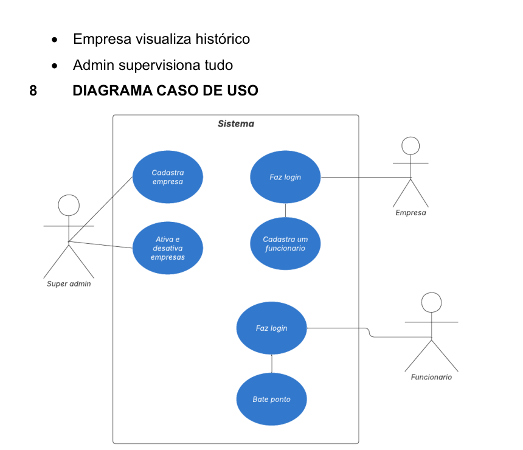
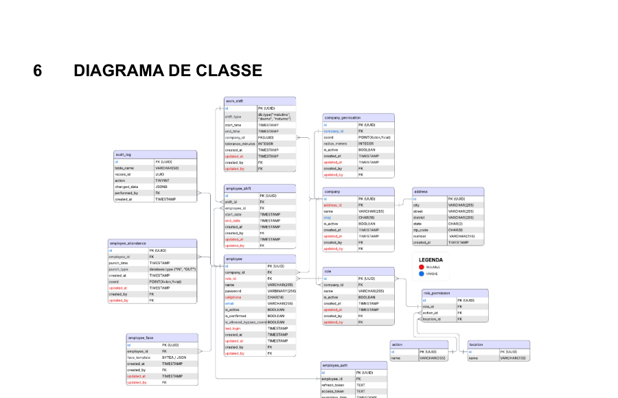
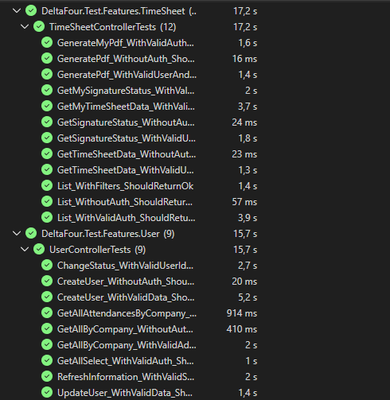
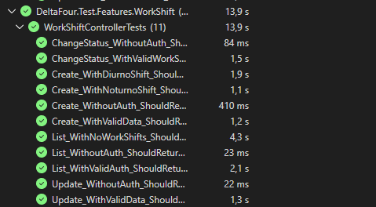
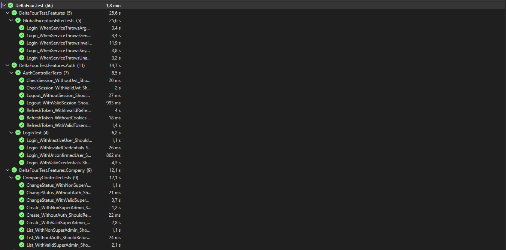
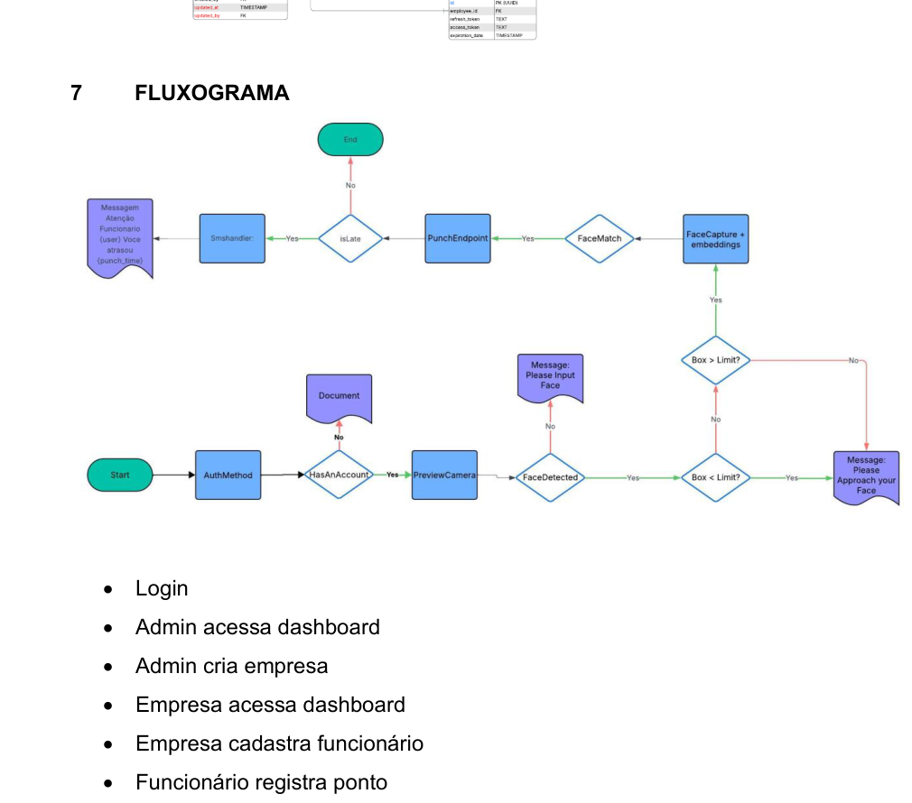

<strong><em>Documentação do PI</em></strong>

> **Projeto:** DeltaFour - Ponto!
> **Instituição:** Centro Paula Souza - Faculdade de Tecnologia de Jahu  
> **Curso:** Tecnologia em Desenvolvimento de Software Multiplataforma  
> **Semestre:** 6º semestre / 2026  
> **Equipe:** Otavio Martins, Gabriel Fogo, Arthur Servidor e Rafael Paschoalotti  
> **Empresa parceira:** STi3 Sistemas LTDA | CNPJ: 07.482.867/0001-70
> **Endereço da parceira:** Av. João Franceschi, 4070 - Jardim Alvorada, Jaú - SP, 17210-381

  
<strong>📑 Sumário</strong>

- [1. Introdução](#1-introdução)
  - [Objetivos](#-objetivos)
  - [Metodologia](#-metodologia)
- [2. Requisitos](#2-requisitos)
  - [Requisitos funcionais](#-requisitos-funcionais)
  - [Requisitos não funcionais](#-requisitos-não-funcionais)
- [3. Modelo de casos de uso](#3-modelo-de-casos-de-uso)
- [4. Modelo do banco de dados](#4-modelo-do-banco-de-dados)
- [5. Banco de dados](#5-banco-de-dados)
- [6. Diagrama de classes](#6-diagrama-de-classes)
- [7. Estudo de viabilidade](#7-estudo-de-viabilidade)
- [8. Regras de negócio (Modelo canvas)](#8-regras-de-negócio-modelo-canvas)
- [9. Design](#9-design)
- [10. Protótipo](#10-protótipo)
- [11. Aplicação](#11-aplicação)

> Esta documentação foi atualizada com base no código-fonte atual, mantendo a estrutura ABNT do material-base.  

# 1. Introdução

O registro de ponto é uma atividade essencial para empresas que precisam acompanhar a jornada de trabalho de seus colaboradores de maneira precisa, segura e confiável. Ainda assim, muitas organizações dependem de sistemas ultrapassados ou pouco integrados, o que gera inconsistências no registro, baixa transparência, dificuldade de gestão e ausência de relatórios dinâmicos.

Para atender a esse cenário, o **DeltaFour - Ponto!** é apresentado como uma plataforma voltada à gestão de ponto eletrônico, com foco em centralizar o controle de presença, o cadastro de funcionários, o gerenciamento de empresas e a geração de folhas de ponto em PDF.

A implementação atual é composta por uma **API em .NET 8**, um **front-end web em React**, um **aplicativo mobile em .NET MAUI** para registro de ponto, integração com **MySQL**, fluxo de **assinaturas via Stripe** e um **microserviço de reconhecimento facial em FastAPI**. O sistema contempla perfis distintos (SUPER_ADMIN, ADMIN, RH e EMPLOYEE), além de validações de geolocalização e biometria facial no registro de ponto.

## • Objetivos

### Objetivo geral

Desenvolver um sistema web de ponto eletrônico capaz de centralizar o controle de jornada de trabalho, oferecendo uma solução completa para administradores, empresas e funcionários, com segurança, organização e fácil utilização.

### Objetivos específicos

- Permitir cadastro de empresas por SUPER_ADMIN e via fluxo público de assinatura.
- Disponibilizar painéis distintos para empresa (ADMIN/RH) e colaborador (EMPLOYEE).
- Gerenciar cadastro de colaboradores e turnos de trabalho.
- Registrar entradas e saídas de ponto com validações de jornada, geolocalização e reconhecimento facial.
- Permitir registro de ponto em atraso com justificativa e anexo.
- Gerar e assinar folha de ponto em PDF.
- Implementar autenticação segura com JWT e cookies.
- Integrar cobrança recorrente via Stripe e reconhecimento facial via microserviço dedicado.
- Disponibilizar aplicativo mobile para registro de ponto com reconhecimento facial.

## • Metodologia

A metodologia escolhida para o desenvolvimento foi o **Scrum**, por sua flexibilidade, divisão clara de tarefas e foco em entregas incrementais. A equipe organizou o trabalho em sprints para conduzir a evolução do backend, frontend, interface e documentação.

### Como?

- Desenvolvimento incremental com sprints.
- Divisão das atividades entre backend, frontend, interface e documentação.
- Comunicação contínua e adaptação rápida a mudanças.

### Com o que?

- **Versionamento de código:** Git e GitHub  
  Repositório informado no documento original: `https://github.com/DeltaFour`
- **API / Backend:** .NET 8, ASP.NET Core, Entity Framework Core, Serilog, FluentValidation, QuestPDF, MailKit, Stripe e NetTopologySuite
- **Frontend:** React 19, Vite 7, Chakra UI, React Router, Axios, Recharts e Framer Motion
- **Reconhecimento facial:** FastAPI, face_recognition, dlib, numpy e Pillow
- **Aplicativo mobile:** .NET MAUI (.NET 8), AndroidX Camera e ML Kit FaceDetection (Android)
- **Infraestrutura:** Docker, MySQL e Nginx

### Onde? Quando?

- **Onde:** aplicação administrativa e portal do colaborador em ambiente web, com microserviço de reconhecimento facial.
- **Quando:** documentação referente ao **6º semestre de 2026**.

# 2. Requisitos

## • Requisitos funcionais

- **RF01 - Autenticação e sessão:** login, renovação de sessão e logout via JWT em cookies.
- **RF02 - Cadastro de empresa com assinatura:** registro público de empresa com checkout Stripe.
- **RF03 - Administração de empresas:** SUPER_ADMIN cria, lista e ativa/desativa empresas.
- **RF04 - Gestão de colaboradores:** criar, listar, atualizar e alterar status de usuários.
- **RF05 - Gestão de turnos:** criar, listar, editar e excluir turnos (com restrições por vínculo).
- **RF06 - Registro de ponto:** entrada/saída com validações de jornada, geolocalização e biometria facial.
- **RF07 - Registro de ponto por terceiros:** RH/ADMIN podem registrar ponto manual para colaboradores.
- **RF08 - Ponto em atraso:** registro retroativo com justificativa e anexo (imagem/PDF).
- **RF09 - Validação de pontos em atraso:** RH pode validar/autorizar registros pendentes.
- **RF10 - Folha de ponto:** gerar PDF, listar, consultar dados e assinar (funcionário e RH).
- **RF11 - Painéis web:** dashboards, histórico de pontos e gráficos (dados mock no front-end).
- **RF12 - Integrações externas:** Stripe (assinaturas) e serviço de reconhecimento facial.
- **RF13 - Aplicativo mobile:** login, painel do colaborador e registro de ponto com câmera e reconhecimento facial.

## • Requisitos não funcionais

A documentação original apresenta os requisitos não funcionais abaixo. Para se adequar ao template, eles foram reorganizados por categoria:

### Requisitos de produto

- **RNF01 - Usabilidade:** interface web responsiva e navegação clara.
- **RNF02 - Desempenho:** endpoints assíncronos e geração eficiente de PDF.
- **RNF04 - Compatibilidade:** funcionamento em navegadores modernos.

### Requisitos de organização

- **RNF08 - Manutenibilidade:** arquitetura em camadas (API, Application, Domain, Infrastructure, CrossCutting).
- Organização do desenvolvimento em sprints, com versionamento por Git e GitHub.

### Requisitos de confiabilidade

- **RNF06 - Confiabilidade:** consistência via MySQL e EF Core (migrations).
- **RNF07 - Disponibilidade:** execução via Docker e logging estruturado com Serilog.

### Requisito de implementação

- **RNF03 - Segurança:** JWT com chave RSA, cookies HttpOnly/Secure e CORS com origem controlada.
- **RNF05 - Escalabilidade:** microserviço de reconhecimento facial e integrações desacopladas.

### Requisito de padrões

A documentação original não detalha um padrão formal específico além das boas práticas adotadas no desenvolvimento. Ainda assim, registra organização modular, autenticação segura e versionamento do código como diretrizes do projeto.

### Requisitos de interoperabilidade

- Integração via HTTP com serviço de reconhecimento facial.
- Preparação para integrações futuras (IoT) permanece como possibilidade, mas não está implementada no código atual.

# 3. Modelo de casos de uso

O modelo de casos de uso atual contempla quatro perfis principais:

- **SUPER_ADMIN**
  - Cadastra empresas
  - Ativa e desativa empresas
- **ADMIN / RH (empresa)**
  - Gerencia colaboradores e turnos
  - Registra ponto para terceiros
  - Valida pontos em atraso
  - Gera e assina folha de ponto
- **EMPLOYEE (colaborador)**
  - Faz login
  - Registra ponto com validações
  - Envia ponto em atraso com justificativa
  - Consulta histórico e folha de ponto

  

# 4. Modelo do banco de dados

A documentação base descreve o banco de dados do projeto como um **modelo relacional em MySQL**, estruturado para priorizar consistência, segurança, rastreabilidade e performance. Para aderir ao template, o conteúdo foi reorganizado em três níveis:

## • Modelo conceitual

O domínio da aplicação gira em torno das seguintes entidades e conceitos centrais:

- Empresa, endereço e geolocalização
- Usuários e autenticação
- Perfis, permissões e ações
- Turnos de trabalho e vínculos usuário-turno
- Registros de ponto (presenças)
- Biometria facial do usuário
- Assinaturas (Stripe) e eventos de cobrança
- Folha de ponto (TimeSheet)

## • Modelo lógico

A modelagem lógica atual evidencia relacionamentos como:

- empresa e usuários;
- usuário e turnos de trabalho;
- usuário e registros de ponto;
- empresa e geolocalização (raio de validação);
- usuário e biometria facial;
- empresa e assinatura;
- folha de ponto por usuário/mês/ano.

Também fica explícito o isolamento do painel por empresa e o controle de acesso por perfil.

## • Modelo físico

No modelo físico informado pela documentação original:

- o banco é implementado em **MySQL**;
- a estrutura utiliza **GUID/UUID** como chave primária;
- as entidades aparecem normalizadas;
- há suporte a georreferenciamento (NetTopologySuite) e rastreabilidade por eventos de assinatura.

# 5. Banco de dados

## Visão geral

O banco de dados do **DeltaFour - Ponto!** é implementado em **MySQL**, utilizando EF Core com migrations e suporte a dados geográficos.

A modelagem atende às necessidades da aplicação de ponto eletrônico, garantindo:

- Integridade dos dados
- Rastreabilidade de ações
- Controle de permissões
- Suporte a geolocalização
- Escalabilidade para integrações futuras

O diagrama foi estruturado em **entidades normalizadas**, com utilização de **UUID** como chave primária para padronização e segurança.

# 6. Diagrama de classes

A imagem abaixo corresponde ao diagrama de classes do projeto.

  

# 7. Estudo de viabilidade

## • Viabilidade técnica

A equipe já possuía experiência prévia com **React**, **C#** e **MySQL**. A arquitetura adotada utiliza camadas bem definidas e integrações externas (Stripe e reconhecimento facial).

## • Viabilidade operacional

O sistema atende a uma necessidade real de empresas que buscam um controle de ponto moderno e centralizado, substituindo processos manuais.

## • Viabilidade econômica

Segundo a documentação original, todos os recursos utilizados são gratuitos. O custo estimado foi tratado como referência acadêmica, considerando **R$ 10,00 por hora por integrante**, representando valor simbólico.

## • Viabilidade de mercado

Sistemas de ponto eletrônico já são amplamente utilizados, mas muitos ainda apresentam custo elevado ou baixa flexibilidade. O **DeltaFour - Ponto!** se diferencia pela simplicidade e pela possibilidade de personalização.

# 8. Regras de negócio (Modelo canvas)

> **Nota:** o PDF original traz as **regras de negócio**, mas não apresenta o quadro do **modelo canvas**. Para manter fidelidade ao material já produzido, esta seção preserva as regras descritas no documento-base.

- **RN01:** cada usuário pertence a uma empresa e herda permissões pelo perfil.
- **RN02:** empresas são criadas por SUPER_ADMIN ou via fluxo público de assinatura.
- **RN03:** registros de ponto seguem o turno ativo e as tolerâncias configuradas.
- **RN04:** se o usuário não tiver bypass de geolocalização, o ponto é validado pelo raio da empresa.
- **RN05:** se o usuário não tiver bypass facial, o ponto exige validação por reconhecimento facial.
- **RN06:** pontos em atraso exigem justificativa e podem incluir anexo; RH recebe notificação por e-mail.
- **RN07:** RH/ADMIN podem registrar ponto para terceiros e validar pontos pendentes.
- **RN08:** turnos não podem ser excluídos se houver colaboradores vinculados.
- **RN09:** folhas de ponto são geradas por usuário/mês/ano e exigem assinatura do colaborador e do RH.
- **RN10:** acesso às APIs é bloqueado quando a assinatura está cancelada ou com pagamento em atraso.

# 9. Design

O design atual é baseado no front-end React com Chakra UI e apresenta os seguintes elementos visuais:

## • Paleta de cor

- **Roxo** como cor de destaque principal
- **Cinzas e neutros** em cartões e áreas secundárias
- **Preto/branco** para contraste e leitura
- **Verde/laranja** para estados (sucesso/alerta)

## • Tipografia

A interface utiliza tipografia sem serifa, com títulos em destaque e textos objetivos, favorecendo leitura rápida em telas web.

## • Logo

O front-end utiliza os logos da marca DeltaFour (LogoHorizontal.png e LogoSolo.png).

## • Wireframes / telas

Abaixo estão os prints das telas do sistema (temas Dark e Claro):

  
<strong>Tema Dark</strong>

   
  

    
    
  

  

    
    
  

  

    
    
  

  

    
    
  

  

    
    
  

  

    
    
  

  
<strong>Tema Claro</strong>

   
  

    
    
  

  

    
    
  

  

    
    
  

  

    
    
  

  

    
    
  

  

    
  

## • Modelo de navegação

Pelas telas apresentadas, o fluxo de navegação visual pode ser entendido como:

**Login → (ADMIN/RH) Dashboard Empresa → Módulos internos**  
**Login → (EMPLOYEE) Dashboard Funcionário → Registro de ponto / Histórico / Timesheet**  
**Cadastro de empresa → Checkout Stripe → Login**

# 10. Protótipo

A documentação original informa o seguinte link de prototipação no Figma:

**Figma:**  
<https://www.figma.com/design/VzVoazrLPfMd1dNkN0keln/MOV-?node-id=0-1&t=1f8FgUnYCXeeP3sA-1>

As telas exibidas na seção de design derivam do material-base e não correspondem integralmente à UI atual.

# 11. Aplicação

## • Estrutura da aplicação

O ecossistema atual é composto por:

- **backend em C# / .NET 8**, com ASP.NET Core, Entity Framework Core e Serilog;
- **frontend web com React + Vite + Chakra UI**;
- **aplicativo mobile em .NET MAUI (DeltaFour.Maui)**;
- **serviço de reconhecimento facial em FastAPI**;
- **banco de dados MySQL**;
- **integração com Stripe** para assinaturas.

## • Funcionalidades operacionais destacadas

- Login com perfil (SUPER_ADMIN, ADMIN, RH, EMPLOYEE)
- Cadastro de empresa com assinatura (Stripe)
- Gestão de colaboradores e turnos
- Registro de ponto com validações (geolocalização e face)
- Registro de ponto em atraso com justificativa e anexo
- Validação de pontos em atraso (RH)
- Geração e assinatura de folha de ponto (PDF)
- Histórico de pontos e dashboards

## • Arquitetura e módulos implementados

### Arquitetura do sistema

- **API** expõe endpoints REST em /api/v1 e aplica validações por perfil e assinatura.
- **Middleware de assinatura** bloqueia acesso quando a assinatura está cancelada ou em atraso.
- **Reconhecimento facial** ocorre via serviço externo (FastAPI) nos endpoints /embedding e /compare.
- **Geolocalização** valida a distância do colaborador em relação ao raio cadastrado da empresa.
- **Geração de PDF** utiliza QuestPDF para emitir folha de ponto.

### Módulos e fluxos implementados

- **Autenticação:** login, verificação de sessão, refresh e logout (JWT em cookies).
- **Empresas (SUPER_ADMIN):** criar, listar e ativar/desativar empresas.
- **Assinaturas:** registro com Stripe, cancelamento, reativação, portal de cobrança e atualização de pagamento.
- **Colaboradores:** criar, listar, editar e alterar status; captura de foto para biometria.
- **Turnos:** CRUD de turnos e tolerâncias.
- **Ponto:** registro com foto, geolocalização e validações; registro para terceiros.
- **Ponto em atraso:** justificativa, anexo (imagem/PDF) e aprovação pelo RH.
- **Timesheet:** geração de PDF, consulta de dados, listagem e assinaturas.
- **Dashboards:** páginas de métricas e gráficos (dados mock no front-end).
- **Mobile (MAUI):** login, painel do colaborador e registro de ponto com câmera, detecção facial e geolocalização.

### Endpoints e integrações existentes

- **Autenticação:** POST /api/v1/auth/login, GET /api/v1/auth/check-session, POST /api/v1/auth/refresh-token, POST /api/v1/auth/logout
- **Empresas (SUPER_ADMIN):** POST /api/v1/admin-control/company/create, POST /api/v1/admin-control/company/change-status/{id}, GET /api/v1/admin-control/company/list
- **Assinaturas (Stripe):** POST /api/v1/subscription/register, GET /api/v1/subscription, POST /api/v1/subscription/cancel, POST /api/v1/subscription/reactivate, GET /api/v1/subscription/billing-portal, GET /api/v1/subscription/update-payment-method, POST /api/v1/webhook/subscription
- **Colaboradores:** GET /api/v1/user/list, POST /api/v1/user/create, PATCH /api/v1/user/update, DELETE /api/v1/user/change-status/{userId}
- **Ponto:** POST /api/v1/user/allowed-punch, POST /api/v1/user/register-point, POST /api/v1/user/punch-for-user, POST /api/v1/user/punch-by-email, POST /api/v1/user/allowed-punch-web
- **RH:** GET /api/v1/user/get-all-attendances, PATCH /api/v1/user/update-status-attendance/{attendanceId}
- **Turnos:** GET /api/v1/workshift/list, POST /api/v1/workshift/create, PATCH /api/v1/workshift/update, DELETE /api/v1/workshift/change-status/{workShiftId}
- **Timesheet:** GET /api/v1/timesheet/list, GET /api/v1/timesheet/pdf/{userId}, GET /api/v1/timesheet/pdf/me, GET /api/v1/timesheet/data/{userId}, GET /api/v1/timesheet/data/me, POST /api/v1/timesheet/{timeSheetId}/sign/employee, POST /api/v1/timesheet/{timeSheetId}/sign/hr, GET /api/v1/timesheet/status/{userId}, GET /api/v1/timesheet/status/me
- **Reconhecimento facial (serviço externo):** POST /embedding, POST /compare
- **Swagger:** /swagger
- **App mobile (MAUI) consome:** /api/v1/auth/login, /api/v1/auth/logout, /api/v1/auth/check-session, /api/v1/auth/refresh-token, /api/v1/user/allowed-punch, /api/v1/user/register-point, /api/v1/user/refresh-information

### Estrutura de pastas

- **BACKEND/**: solução .NET (API, Application, Domain, Infrastructure, CrossCutting, Test)
- **BACKEND-feature-MauiNet/**: solução .NET com aplicativo mobile DeltaFour.Maui
- **FRONTEND/**: aplicação React (Vite) com Chakra UI
- **face-recognition-api/**: microserviço FastAPI de reconhecimento facial

### Instalação e execução

**Backend + MySQL (Docker)**

1. Copiar BACKEND/DeltaFour.API/.env.example para BACKEND/DeltaFour.API/.env e preencher as variáveis.
2. Executar: docker compose up -d --build (dentro da pasta BACKEND).

**Frontend (Docker)**

1. Criar FRONTEND/.env com VITE_BASE_URL e, opcionalmente, VITE_USE_MOCK=true.
2. Executar: docker compose up -d --build (dentro da pasta FRONTEND).

**Reconhecimento facial (Docker)**

1. Executar: docker compose up -d --build (dentro da pasta face-recognition-api).

**Aplicativo mobile (MAUI)**

1. Abrir a solução em BACKEND-feature-MauiNet/DeltaFour.sln.
2. Ajustar a URL da API no MauiProgram.cs (BaseAddress).
3. Executar o projeto DeltaFour.Maui no emulador/dispositivo.

# 12. Testes de Qualidade de Software

Esta seção reúne prints de execução de testes e verificações de qualidade aplicadas ao projeto.

## • Testes realizados

- **Teste 1:** Integração de registro de ponto (mobile → API → banco).
- **Teste 2:** Fluxo de autenticação e renovação de sessão (login, refresh, logout).
- **Teste 3:** Geração e exportação de folha de ponto em PDF.

  

  

  

As imagens acima foram capturadas durante execuções de integração e testes manuais. Recomenda-se incluir os scripts de teste automatizados (unitários e de integração) no repositório e vincular pipelines CI para garantir qualidade contínua.

**Observações importantes**

- A API expõe a porta 8080 e o front-end usa Nginx na porta 5173.
- O serviço de reconhecimento facial expõe a porta 8000.
- O CORS do backend exige ALLOWED_HOST configurado para a URL do front-end.
- Os cookies de autenticação são marcados como Secure e SameSite=None.

### Variáveis de ambiente (principais)

**Backend (DeltaFour.API/.env)**

- CONNECTION_STRING
- IS_TESTING
- VALIDATE_LIFETIME, REQUIRE_EXPIRATION_TIME, VALIDATE_ISSUER_SIGNING_KEY, VALIDATE_ISSUER, VALIDATE_AUDIENCE
- PYTHONNET_PYDLL, FUNCTION_PYTHON_PATH
- SUPER_ADMIN_EMAIL, SUPER_ADMIN_NAME, SUPER_ADMIN_COMPANY_CNPJ, SUPER_ADMIN_COMPANY_NAME, SUPER_ADMIN_PASSWORD
- ALLOWED_HOST
- FACE_RECOGNITION_BASE_URL
- STRIPE_SECRET_KEY, STRIPE_PRICE_ID, STRIPE_SUCCESS_URL, STRIPE_CANCEL_URL, STRIPE_WEBHOOK_SECRET
- EMAIL_HOST, EMAIL_PORT, EMAIL_USERNAME, EMAIL_PASSWORD, EMAIL_FROM_EMAIL, EMAIL_FROM_NAME

**Frontend (FRONTEND/.env)**

- VITE_BASE_URL
- VITE_USE_MOCK

## • Fluxograma

A imagem abaixo representa o fluxo geral de autenticação e reconhecimento facial.

  

## • Implementação com IoT no futuro

Possibilidades de expansão registradas no documento original:

- Leitores biométricos integrados à API
- Totens inteligentes
- Registro automático via RFID ou NFC
- Comunicação com ESP32 para registros físicos

## • Cronograma resumido

- **1-2 semanas:** requisitos e arquitetura
- **3-4 semanas:** protótipos
- **5-6 semanas:** backend
- **7-8 semanas:** frontend
- **9-10 semanas:** integração
- **11-12 semanas:** testes e documentação

## • Considerações finais

O desenvolvimento do **DeltaFour - Ponto!** consolida uma solução web moderna para controle de ponto, com fluxo de assinatura, validação facial e geração de folha de ponto.

Segundo o texto-base, a arquitetura adotada buscou criar um ecossistema integrado, moderno e escalável, apto a atender demandas empresariais relacionadas à jornada de trabalho, rastreabilidade e segurança da informação. A implementação atual confirma o uso de camadas bem definidas, autenticação segura, estruturação do banco MySQL e validações de geolocalização e biometria facial.

Em síntese, o projeto é uma solução eficiente, moderna e confiável, com potencial de uso acadêmico e empresarial.

## • Referências

- GIT. _Git Documentation_. Disponível em: <https://git-scm.com/doc>.
- GITHUB. _GitHub Docs_. Disponível em: <https://docs.github.com/>.
- MICROSOFT. _.NET MAUI Documentation_. Disponível em: <https://learn.microsoft.com/dotnet/maui/>.
- MICROSOFT. _.NET 8 Documentation_. Disponível em: <https://learn.microsoft.com/dotnet/>.
- MICROSOFT. _ASP.NET Core Documentation_. Disponível em: <https://learn.microsoft.com/aspnet/core/>.
- MICROSOFT. _Entity Framework Core Documentation_. Disponível em: <https://learn.microsoft.com/ef/>.
- REACT. _React Documentation_. Disponível em: <https://react.dev/>.
- VITE. _Vite Documentation_. Disponível em: <https://vitejs.dev/guide/>.
- CHAKRA UI. _Chakra UI Documentation_. Disponível em: <https://chakra-ui.com/>.
- STRIPE. _Stripe Documentation_. Disponível em: <https://stripe.com/docs>.
- FASTAPI. _FastAPI Documentation_. Disponível em: <https://fastapi.tiangolo.com/>.
- SERILOG. _Serilog Documentation_. Disponível em: <https://serilog.net/>.
- QUESTPDF. _QuestPDF Documentation_. Disponível em: <https://www.questpdf.com/>.
- DOCKER. _Docker Documentation_. Disponível em: <https://docs.docker.com/>.
- MYSQL. _MySQL Reference Manual_. Disponível em: <https://dev.mysql.com/doc/>.
- SCRUM ALLIANCE. _O que é Scrum?_. Disponível em: <https://www.scrumalliance.org/>.
